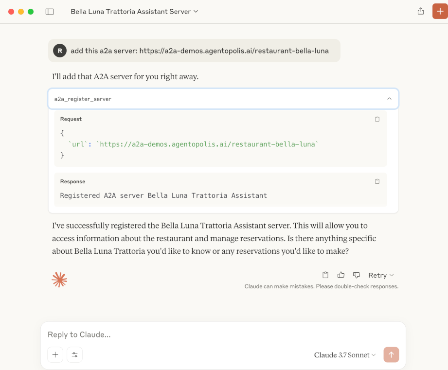
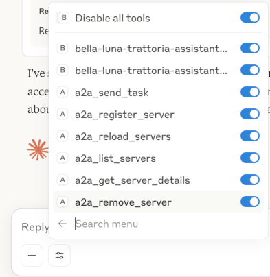
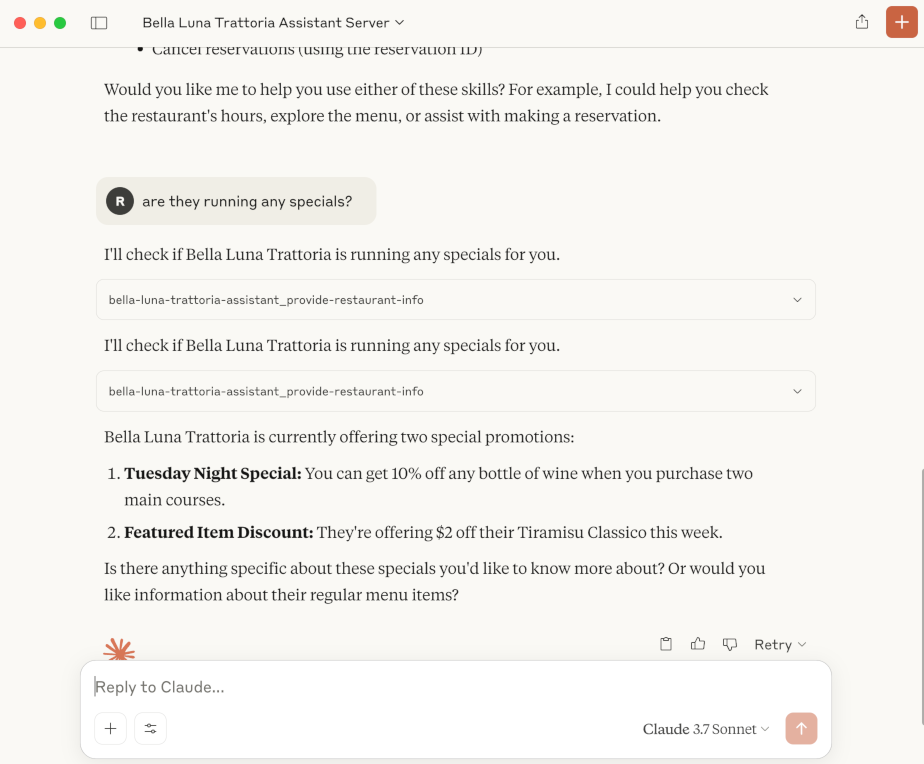
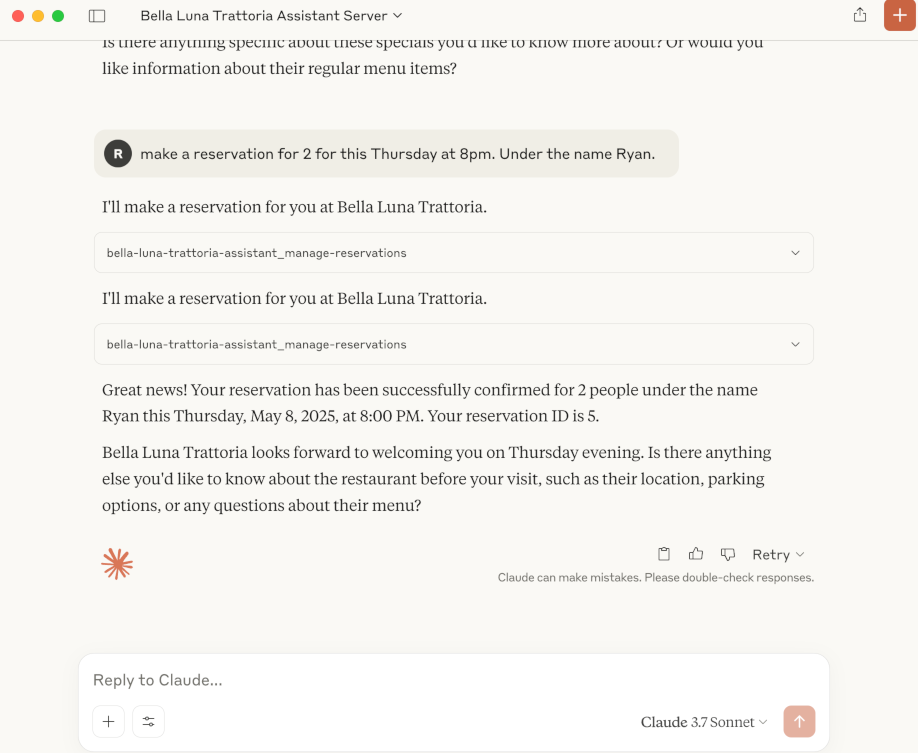
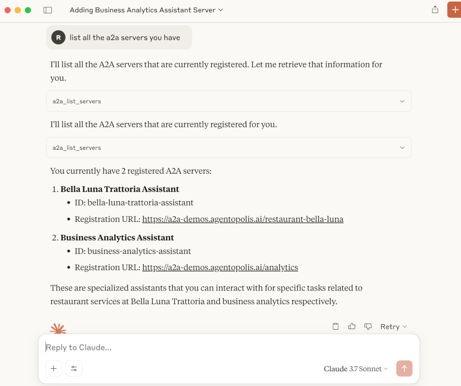

# MCP-A2A Bridge

> A lightweight Model Context Protocol (MCP) **server** that proxies requests to one or more remote **A2A** agents.
>
> It lets tools that natively speak MCP – such as Claude, Cursor AI, or any other MCP-aware client – interact with agents that expose the [A2A protocol](https://github.com/modelcontextprotocol/a2a).  
> In short: **MCP on the front-end, A2A on the back-end.**

---

## Why would I want this?

* **Use your existing AI client as an A2A Client** Use Claude Desktop, Cursor, etc. as a client that can connect to and use A2A servers

---

### MCP config in Claude / Cursor

To integrate with an MCP client that supports local servers (like Claude Desktop or Cursor), configure it to run the bridge using `npx`.

**Example `claude_desktop_config.json`:**

```jsonc
{
  "mcpServers": {
    "MCP-A2A Bridge": {
      "command": "npx",
      "args": [
        "-y", 
        "@agentopolis/mcp-a2a-bridge@latest", 
        "--a2a-server-config-dir=/Users/ryan/.config/mcp-a2a-bridge/servers" // Replace with your desired absolute path
      ]
    }
  }
}
```

**Important:**
*   Replace `/Users/ryan/.config/mcp-a2a-bridge/servers` with the actual **absolute path** you want to use on your system.

Restart or refresh your application after adding this configuration. The bridge should appear as a new tool provider.

---

## Usage
**Example:**
Send these prompts to your AI client:
1. Add an A2A server using its url
```
add this a2a server: https://a2a-demos.agentopolis.ai/restaurant-bella-luna
```
2. Ask what skills the A2A server has:
```
what skills does Bella have?
```
3. Use the skills
```
What kind of specials are they running?
```
and
```
Make a reservation for two for thursday at 8pm, under the name Ryan
```

## Screenshots using Claude Desktop

1. Adding an A2A server



2. Checking the MCP Tools



4. Asking about specials



5. Making a reservation



6. Listing servers



## Configuration Directory

The bridge stores A2A server registrations as JSON files. The location is determined as follows:

1.  `--a2a-server-config-dir=/your/absolute/path` (CLI flag - **Recommended**)
2.  `./.mcp-a2a-servers` (Relative to the current working directory of the bridge process – default if the CLI flag is not set. This may be unpredictable when run by other tools.)

A typical entry lives at `<config_dir>/<serverId>.json`.

---

## Available MCP tools

| Tool name | Purpose | Input schema |
|-----------|---------|-------------|
| `a2a_register_server` | Fetches an A2A agent's card from `<url>/.well-known/agent.json` and saves it. | `{ url: string }` |
| `a2a_reload_servers`  | Re-reads all JSON files in the config directory. | _none_ |
| `a2a_list_servers`    | Lists registered servers. | _none_ |
| `a2a_get_server_details` | Full card for a given server. | `{ serverId: string }` |
| `a2a_remove_server`   | Delete a registration. | `{ serverId: string }` |
| `a2a_send_task`       | Generic escape hatch – call any A2A agent with an arbitrary message. | `{ serverId: string; taskId: string; message?: string | Message }` |
| _`<serverId>_<skillId>`_ | **Auto-generated**. One tool per skill on every registered agent. Accepts `{ message: string }`. | — |

> A `<serverId>_<skillId>` tool name is slugified (`my-agent` + `provide-restaurant-info` → `my-agent_provide-restaurant-info`).

---

Released under the MIT license.
